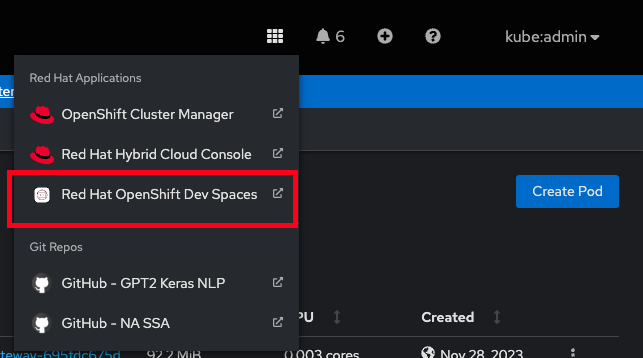
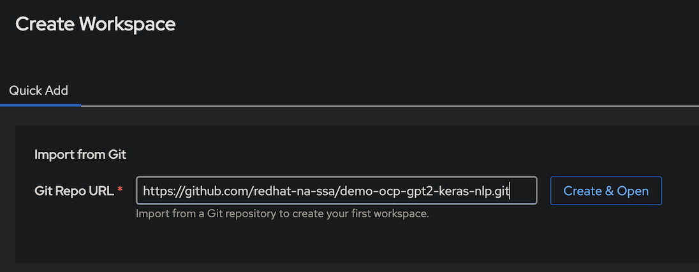
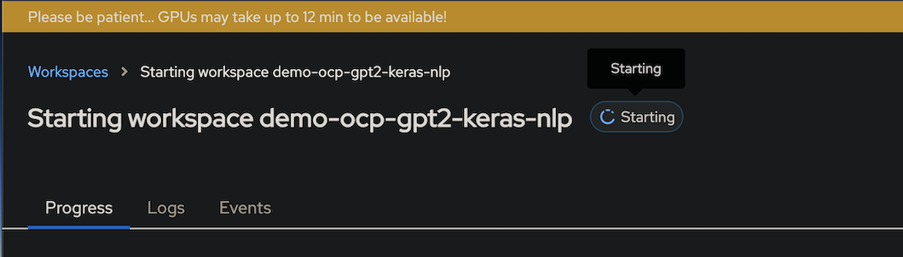

# OpenShift Dev Spaces for AI / ML

This repo demos helps show the value of OpenShift and OpenShift Dev Spaces as a platform for developing and deploying AI / ML workloads in a hybrid cloud.

## Installation

### Prerequisites

- [x] Red Hat OpenShift Cluster 4.16+
- [x] Cluster admin permissions

[Red Hat Demo Platform](https://demo.redhat.com) Options (Tested)

NOTE: The node sizes below are the **recommended minimum** to select for provisioning

- <a href="https://demo.redhat.com/catalog?item=babylon-catalog-prod/sandboxes-gpte.sandbox-ocp.prod&utm_source=webapp&utm_medium=share-link" target="_blank">AWS with OpenShift Open Environment</a>
  - 1 x Control Plane - `m6a.2xlarge`
  - 0 x Workers - `m6a.2xlarge`
- <a href="https://demo.redhat.com/catalog?item=babylon-catalog-prod/sandboxes-gpte.ocp4-single-node.prod&utm_source=webapp&utm_medium=share-link" target="_blank">One Node OpenShift</a>
  - 1 x Control Plane - `m6a.2xlarge`
- <a href="https://demo.redhat.com/catalog?item=babylon-catalog-prod/community-content.com-mlops-wksp.prod&utm_source=webapp&utm_medium=share-link" target="_blank">MLOps Demo: Data Science & Edge Practice</a>

## Getting Started

### Install the [OpenShift Web Terminal](https://docs.openshift.com/container-platform/4.12/web_console/web_terminal/installing-web-terminal.html)

The following icon should appear in the top right of the OpenShift web console after you have installed the operator. Clicking this icon launches the web terminal.


### From a terminal

```sh
# start in a bash shell
# (this means you mac users; zsh)

# oc login to your cluster
# oc login --token=<yours> --server=https://<yours>
oc whoami
```

```sh
# git clone demo
git clone https://github.com/redhat-na-ssa/demo-ai-devspaces.git
cd demo-ai-devspaces

# run setup script
./scripts/bootstrap.sh

# expected results
  # Running: oc apply -k gitops
  # again...
  # again...
  # [OK]
```

### Uninstall

```sh
# WARNING: Be certain you want your cluster returned to a vanilla state
. ./scripts/bootstrap.sh

delete_demo
```

## Walkthrough

- Launch DevSpaces from the waffle menu on the OCP Web Console

> [!NOTE]
> This may take 5+ mins post bootstrap setup



- `Create & Open` DevSpaces with the current repo



- Click the `Events` submenu to watch progress

> [!NOTE]
> This may take 12+ mins



## Additional Resources

### Tools

The following cli tools are required:

- `bash`, `git`
- `oc` - Download [mac](https://formulae.brew.sh/formula/openshift-cli), [linux](https://mirror.openshift.com/pub/openshift-v4/clients/ocp), [windows](https://mirror.openshift.com/pub/openshift-v4/clients/ocp/stable/openshift-client-windows.zip)
- `kubectl` (optional) - Included in `oc` bundle
- `kustomize` (optional) - Download [mac](https://formulae.brew.sh/formula/kustomize), [linux](https://github.com/kubernetes-sigs/kustomize/releases)

NOTE: `bash`, `git`, and `oc` are available in the [OpenShift Web Terminal](https://docs.openshift.com/container-platform/4.12/web_console/web_terminal/installing-web-terminal.html)

### Links

OpenShift Dev Spaces

- [OpenShift Dev Spaces - Overview](https://developers.redhat.com/products/openshift-dev-spaces/overview)
- [OpenShift Dev Spaces - Getting Started](https://developers.redhat.com/products/openshift-dev-spaces/getting-started)
- [OpenShift Dev Spaces - Video Overview (20m)](https://youtu.be/Jfd0F0-uYfU)
- [OpenShift Dev Spaces - Official Docs](https://access.redhat.com/documentation/en-us/red_hat_openshift_dev_spaces/3.9)
- [Configure Dev Spaces with Auth](https://eclipse.dev/che/docs/stable/end-user-guide/using-a-git-provider-access-token/)

Data Science Examples

- [Data Science Example - Fingerprint Prediction](https://github.com/redhat-na-ssa/datasci-fingerprint)
- [Data Science Example - Computer Vision](https://github.com/redhat-na-ssa/flyingthings)
- [Data Science Example - Keras GPT2 NLP](https://github.com/redhat-na-ssa/demo-ocp-gpt2-keras-nlp)

Other Examples

- [OpenShift - LLM using custom data source](https://github.com/redhat-na-ssa/demo-ai-weaviate)
